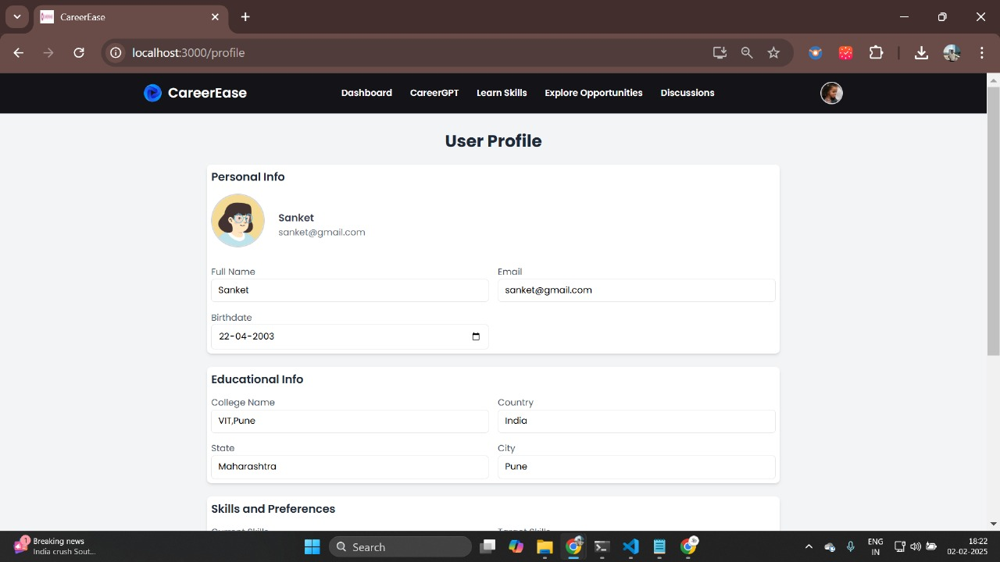
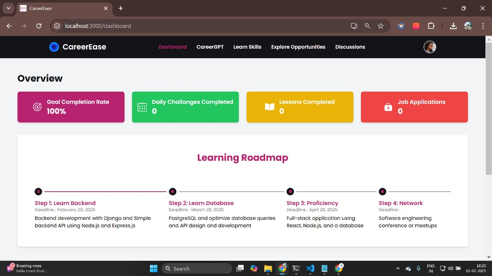
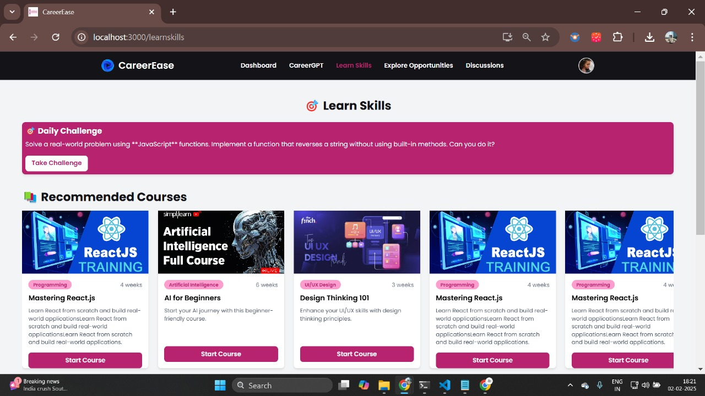
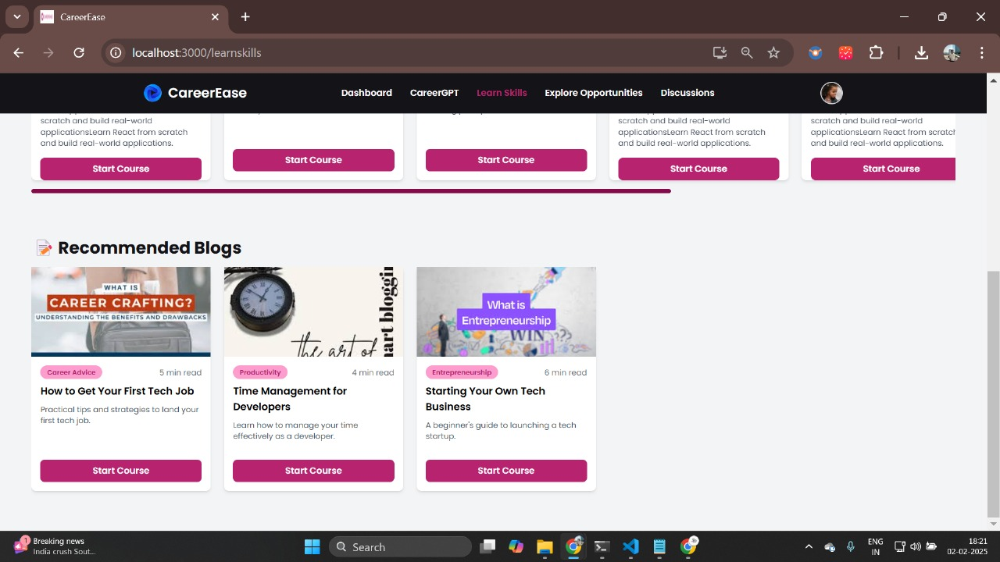
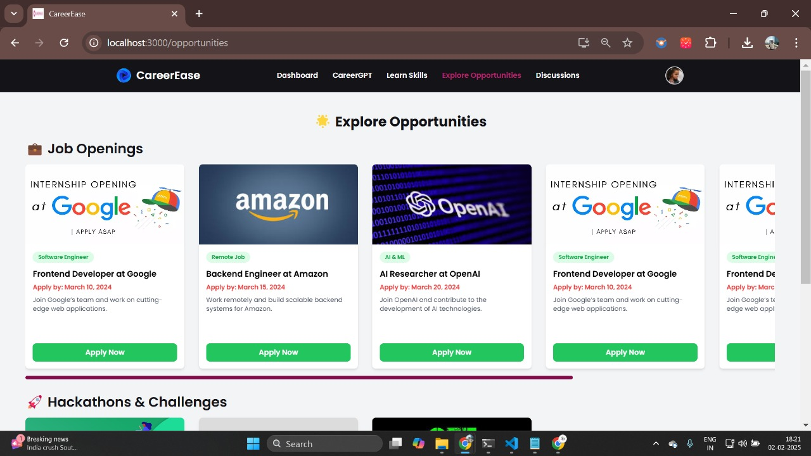
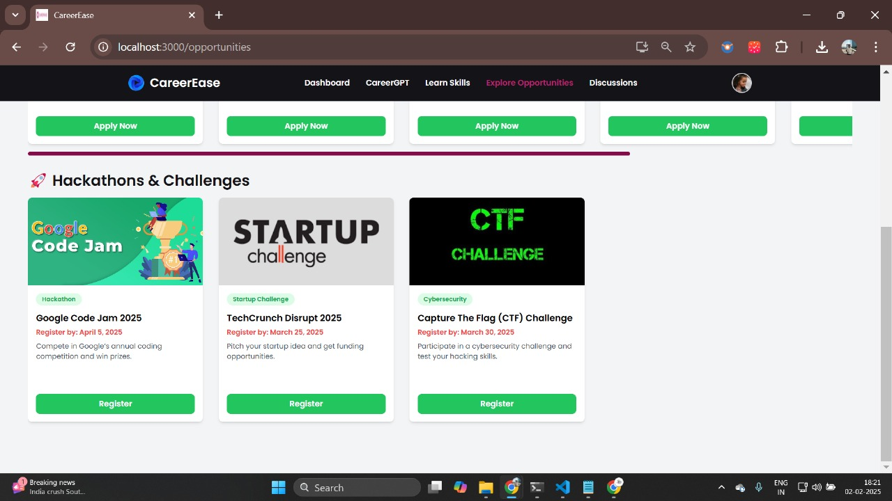
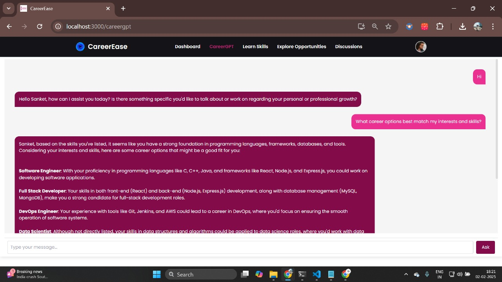
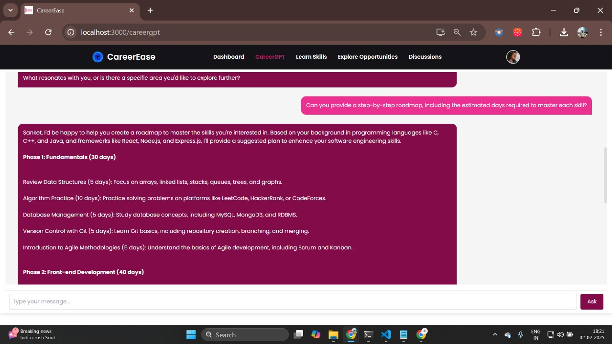
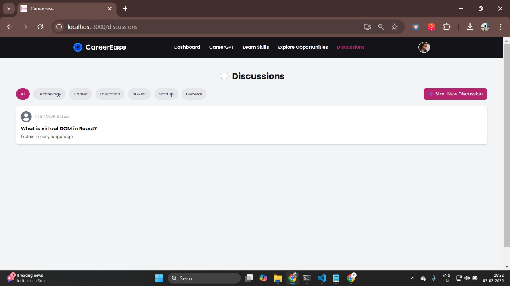
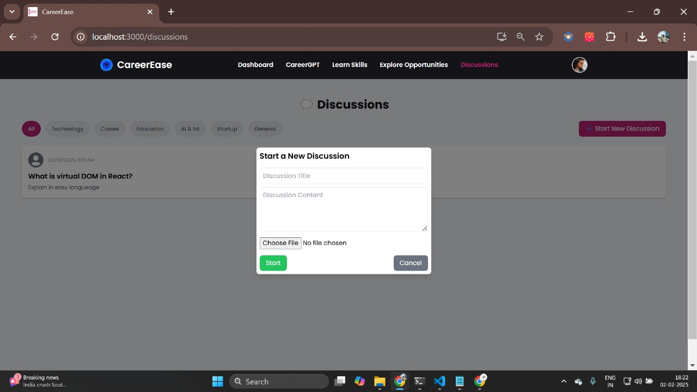

# CareerEase - AI Career Counsellor

CareerEase is an AI-powered career counseling platform that helps users plan their career journey with personalized recommendations, skill learning paths, job openings, and an interactive discussion forum.

## 🚀 Features

- 🔐 **Sign In / Sign Up** - Secure authentication for users.
- 👤 **Profile Management** - Users can update personal details and career interests.
- 📊 **Dashboard** - Personalized dashboard with career insights.
- 🛤 **Learning Roadmap** - AI-driven career path suggestions.
- 🎯 **Goals Management** - Set and track career goals.
- 📚 **Learn Skills** - Recommended blogs and courses for skill development.
- 💼 **Job Openings** - Job postings, hackathons, and internship opportunities.
- 🤖 **Career GPT** - AI-powered career guidance chatbot.
- 💬 **Discussion Forum** - Community discussions, adding posts, and commenting on discussions.


---

## 🌐 Live Demo

🔗 **Hosted Link:** [CareerEase Live](https://career-ease-frontend.vercel.app/)

📝 **Demo Credentials:**
- **Username:** test4@gmail.com
- **Password:** test@123

---

## 📸 Screenshots

### 📊 Home Page


### 🔐 Sign In / Sign Up


### 👤 Profile Management


### 📊 Dashboard


### 🛤 Learning Roadmap


### 🎯 Goals Management


### 📚 Learn Skills



### 💼 Job Openings



### 🤖 Career GPT



### 💬 Discussion Forum



---

## 🛠 Tech Stack
- **Frontend:** React.js, Javascript, Tailwind CSS
- **Backend:** MongoDB, ExpressJS, NodeJS
- **Authentication:** OAuth (Hydra), JWT
- **AI Integration:** GROQ API for Career GPT
- **State Management:** React Query

---

## 📦 Installation

```sh
# Clone the repository
git clone https://github.com/yourusername/careerease.git
cd careerease

# Install dependencies
npm install

# Start the development server
npm run dev
```

